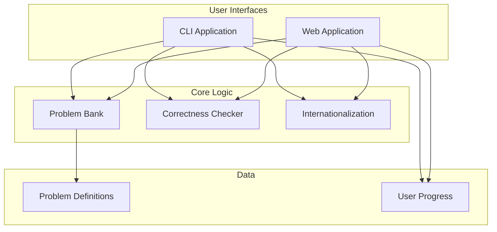
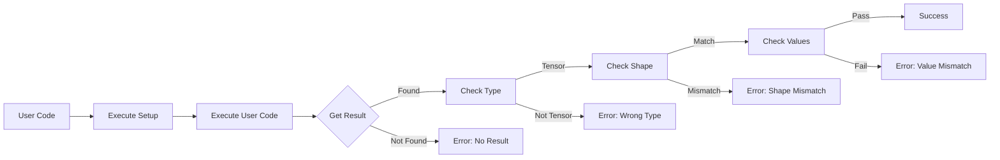
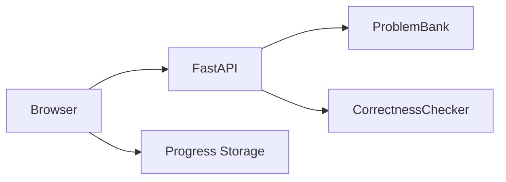
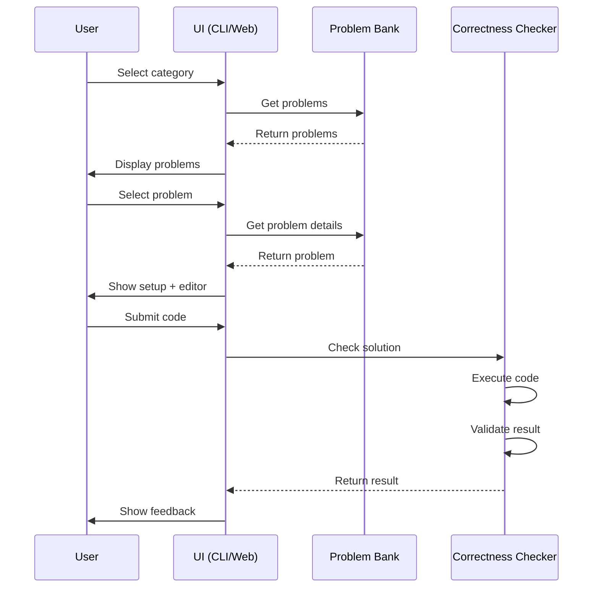

# PyTorch Tensor Marathon - Architecture

## Overview

PyTorch Tensor Marathon is a bilingual educational platform for mastering PyTorch tensor operations through hands-on practice. The system consists of a CLI application and a web application, both sharing the same problem bank and validation logic.

## System Architecture



## Project Structure

```
torch_tensor_marathon/
├── src/torch_tensor_marathon/     # Core application code
│   ├── __init__.py
│   ├── main.py                    # CLI entry point
│   ├── config.py                  # Configuration management
│   ├── problem.py                 # Problem data model
│   ├── checker.py                 # Solution validation logic
│   ├── problem_bank.py            # Problem storage and retrieval
│   ├── cli.py                     # CLI interface
│   ├── i18n.py                    # Internationalization
│   └── problems/                  # Problem definitions by category
│       ├── __init__.py
│       ├── reshape_permute.py
│       ├── indexing_slicing.py
│       ├── broadcasting.py
│       ├── gather_scatter.py
│       ├── einsum.py
│       ├── stacking_splitting.py
│       ├── advanced_ops.py
│       └── dl_applications.py
│
├── web/                           # Web application
│   ├── app.py                     # FastAPI backend
│   └── static/
│       ├── index.html             # Main HTML
│       ├── style.css              # Styling
│       ├── app.js                 # Frontend logic
│       └── i18n.js                # Frontend translations
│
├── docs/                          # Documentation
│   ├── screenshots/               # Application screenshots
│   └── ARCHITECTURE.md            # This file
│
├── pyproject.toml                 # Project configuration
├── README.md                      # User documentation
├── CONTRIBUTING.md                # Contribution guidelines
├── CHANGELOG.md                   # Version history
└── LICENSE                        # MIT License
```

## Core Components

### 1. Problem Bank (`problem_bank.py`)

**Responsibility**: Centralized storage and retrieval of all problems.

**Key Features**:
- Category-based organization
- Difficulty filtering
- Problem lookup by ID
- Statistics generation

**Interface**:
```python
class ProblemBank:
    def add_category(category_id: str, problems: List[Problem])
    def get_all_categories() -> List[CategoryInfo]
    def get_problems_by_category(category_id: str) -> List[Problem]
    def get_problem_by_id(problem_id: str) -> Problem | None
    def get_stats() -> dict
```

### 2. Correctness Checker (`checker.py`)

**Responsibility**: Validate user solutions against expected results.

**Validation Process**:


**Key Features**:
- Isolated namespace execution
- Shape validation
- Value validation with `torch.allclose`
- Detailed error reporting
- Stdout/stderr capture

**Interface**:
```python
class CorrectnessChecker:
    def check_solution(problem: Problem, user_code: str) -> CheckResult
```

### 3. Problem Definition (`problem.py`)

**Data Model**:
```python
@dataclass
class Problem:
    id: str                    # Unique identifier
    category: str              # Category ID
    difficulty: str            # beginner|intermediate|advanced|expert

    # Bilingual content
    title_ja: str
    title_en: str
    description_ja: str
    description_en: str
    hint_ja: str | None
    hint_en: str | None

    # Code
    setup_code: str            # Executed before user code
    solution_code: str         # Expected solution
```

### 4. CLI Interface (`cli.py`)

**Responsibility**: Interactive terminal interface for problem solving.

**Features**:
- Rich UI with syntax highlighting
- Category browser
- Problem solver
- Progress tracking
- Solution viewing

**State Flow**:
```
Welcome → Category Selection → Problem List → Problem Solver
   ↑______________________________________________|
```

### 5. Web Application (`web/app.py`)

**Technology Stack**:
- **Backend**: FastAPI
- **Frontend**: Vanilla JavaScript
- **Styling**: CSS with custom properties
- **Syntax Highlighting**: Prism.js

**Architecture**:


## Data Flow

### Problem Solving Flow



## Internationalization

**Strategy**: Pre-translated content stored in both Japanese and English.

**Implementation**:
- `i18n.py`: Backend translations
- `i18n.js`: Frontend translations
- All UI strings and problem content are bilingual
- Runtime language switching

**Translation Coverage**:
- UI elements
- Problem titles and descriptions
- Error messages
- Instructions and hints
- Category names

## Extension Points

### Adding New Categories

1. Create new file in `src/torch_tensor_marathon/problems/`
2. Define problems using `Problem` dataclass
3. Call `initialize_problems()` to register

Example:
```python
# src/torch_tensor_marathon/problems/my_category.py
from ..problem import Problem

def register_my_category_problems(problem_bank):
    problems = [
        Problem(
            id="my_cat_001",
            category="my_category",
            # ... other fields
        ),
    ]
    problem_bank.add_category("my_category", problems)
```

### Adding New Validation Logic

Extend `CorrectnessChecker`:
```python
class CustomChecker(CorrectnessChecker):
    def check_solution(self, problem, user_code):
        result = super().check_solution(problem, user_code)
        # Add custom validation
        return result
```

### Integrating AI (Gemini API)

The system supports optional Gemini API integration for:
- Dynamic problem generation
- Hint generation
- Code explanation
- Difficulty adaptation

Environment variable: `GEMINI_API_KEY`

## Performance Considerations

### Problem Bank
- **Loading**: All problems loaded at startup
- **Memory**: ~1MB for 100 problems
- **Lookup**: O(1) for ID-based, O(n) for category

### Code Execution
- **Isolation**: Each execution in fresh namespace
- **Timeout**: None currently (could add with `signal`)
- **Memory**: Bounded by PyTorch tensor operations

### Web Application
- **Static Files**: Cached by browser
- **API Latency**: < 100ms typical
- **Concurrency**: FastAPI async support

## Security

### Code Execution Safety
- Restricted namespace (no file I/O, no imports except torch)
- No access to system modules
- Stdout/stderr captured
- Exception handling prevents crashes

### Web Application
- CORS enabled (development)
- No authentication (stateless)
- Input validation on all endpoints
- No persistent user data on server

## Testing Strategy

### Manual Testing
```bash
# CLI
uv run tensor-marathon --lang en

# Web
uv run uvicorn web.app:app --reload
```

### Automated Testing (Future)
- Unit tests for `CorrectnessChecker`
- Integration tests for `ProblemBank`
- E2E tests for web application

## Future Architecture Enhancements

1. **Database Integration**: Store problems in DB for dynamic updates
2. **User Accounts**: Add authentication and per-user progress
3. **Caching Layer**: Redis for frequently accessed data
4. **Containerization**: Docker for easy deployment
5. **Monitoring**: Add logging and metrics collection
6. **API Versioning**: Support multiple API versions
7. **WebSocket**: Real-time updates and collaboration

## Dependencies

### Core
- `torch`: PyTorch tensor operations
- `pyyaml`: Configuration files (if needed)

### CLI
- `rich`: Terminal UI and formatting
- `click`: Command-line argument parsing

### Web
- `fastapi`: Web framework
- `uvicorn`: ASGI server
- `pydantic`: Data validation

### Frontend
- Prism.js: Syntax highlighting
- Vanilla JavaScript (no frameworks)

## License

MIT License - See LICENSE file for details.
